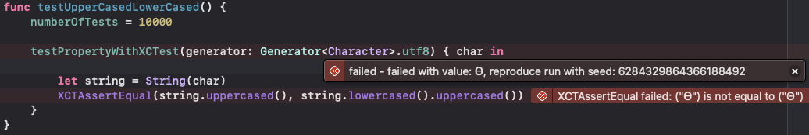

# Tenta
Tenta is a property based testing framework for Swift, in development.
Tenta is Swedish slang for "Test", typically used in a University setting.

## Examples

```swift
    // Assert that the reverse of any array keeps its length.
    runTest { (array: [Int]) in
        array.count == array.reversed().count
    }

```

or if you want to, add `Tenta.TestObservation` as your `NSPrincipalClass`
and you should be able to write your tests like this:

```swift
    // Assert that the reverse of any array keeps its length.
    runWithXCTest { (array: [Int]) in
        XCTAssertEqual(array.count, array.reversed().count)
    }

```

When a test fails it will try to find the smallest example of a failing
value and present you with an example of how to reproduce the error.



## Design goals/philosophy

Tenta should be:

* Easy to understand.
* Easy to read.
* Provide sensible defaults.
* Have clear documentation driven by examples.
* Avoid unnecessary generalizations.
* Avoid the "M"-word (no Monads or Functors).
* Avoid custom operators
* Integrate well with XCTest.
